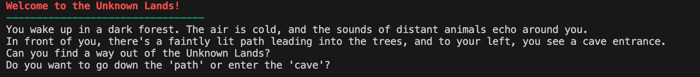
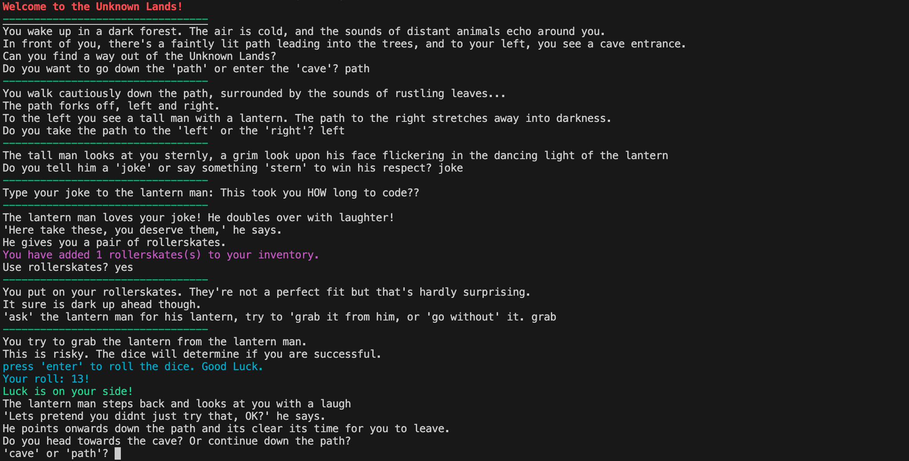

# The Unknown Lands



Welcome to the Unknown Lands. In order to practice my python skills I have created the following text input based adventure game. Creating this game has pulled together all of the Python that I have learnt so far, such as functions, loops, lists, dictionaries, and 'if', 'elif', 'else' logic. The game works by beginning at the 'start_game()' function and then jumping to different functions depending on the choices that are made.

In the game you can collect and even trade items which are then added to your inventory and can be used later. Sound effects play and the music changes according to different choices you make and also, in classic dungeons and dragons style, many decisions are influenced by the outcome of the player rolling a 20 sided dice.

Creating this game has been an incredibly useful and enjoyable practice of using python. This is my first solely python based project and after completing a bootcamp and learning the language through online courses, it has been great to genuinely use this knowledge to create something real rather than just practicing the skills in isolation.

# How to Play:

## Step 1: Install Required Software.
Before running the game, ensure you have the following installed by opening the terminal / command prompt and typing the following:

Python 3.12
```
python3 --version
```
pip
```
pip3 --version
```
Git
```
git --version
```
If you are missing python and pip, go to [this link](https://www.python.org/downloads/) to download the latest version of python. pip should also be downloaded with this. Run the above codes again after download to check it has been successful.

If you are missing Git, try the following:

For Mac users:
```
xcode-select --install
```
For Windows users: 
```
winget install --id Git.Git -e --source winget
```
If your pc has winget installed this will install Git. If not Git can be downloaded from [this link](https://git-scm.com/downloads/win).

## Step 2: Navigate to Desired Download Folder.
In your terminal / command prompt, the next step is to navigate to the folder that you would like to download the game into. To do this you can use the following cd command. For example, if you want to download the game to your desktop, you can use the example below. Remember to replace 'name' with your own name.

Mac example: 
```
cd /Users/name/Desktop
```
Windows example:
```
cd \Users\name\Desktop
```
If you're not sure what your name is in this context, use the following command to find out:
```
whoami
```
## Step 3: Clone the Github Repository.
In your terminal / command prompt, clone the github repository into your desired folder using the following command:
```
git clone <https://github.com/joecockman/The-Unknown-Lands>
```
## Step 4: Navigate to the Game Folder.
Now the game is downloaded, navigate to that folder using the following cd command:

Mac example:
```
cd /The_Unknown_Lands
```
Windows example:
```
cd \The_Unknown_Lands
```
## Step 5: Install requirements.
Use the following code in the terminal to download required python libraries:
```
pip3 install -r requirements.txt
```
## Step 6: Run the game.
Use the following command to run the game:
```
python3 The_Unknown_Lands.py
```
## Step 7: Have fun and Good Luck!

Read on for descriptions of how I put specific parts of the game together and why I made the specific decisions that I made.

# Imported Modules
```
from colorama import Fore, Back, Style, init
init(autoreset=True)

import random
from IPython.display import Image, display
from IPython.display import Audio

import pygame
pygame.init()
pygame.mixer.init()

import os
import sys
```

# Essential Inventories and Lists
```
inventory = {}
knight_inventory = {"giants's wig": 1, "cool rock": 2}
achievements = {"Usain Bolt": None, "The double": None, "Amongst the Lantern Men": None, "Boogie on Down": None, "Terrible Dancer": None, "Dancing Queen": None, "Terrible Singer": None, "Like Freddie Mercury at Bandaid": None, "Terrible Groveller": None, "Wallace and Grovel": None, "Find Inner Peace": None, "Fizzy Boy": None, "Lanternwood Inc": None, "Varnishpark": None, "rickrolled in the unknown lands": None}
collected_items = {"cool rock - cave entrance": None, "cool rock - secret room": None, "cool rock - rollerskates": None, "cool rock - secret secret room": None, "mysterious tokens - cave end": None, "mysterious token - unknown things": None, "mysterious token - from a successful gloat": None, "mysterious token - lantern man fight": None, "the book of stern faces colouring book": None, "rollerskates": None, "torch": None, "lantern man's lantern": None, "train tickets": None, "giant's wig": None, "200m Olympic gold medal": None, "lantern man sticker": None, "horn of the unknown things": None}
characters = {"knight": None}
total_dance_score = 0
```
Inventory is set as an empty dictionary which is updated when items are found using the add_to_inventory() function, detailed below.

The 'collected_items' dictionary sets all items in the game to have a value of 'None'. When the player finds them, the value is changed to 'Found'. I then built my functions to behave differently if the item was found or not found, preventing players from finding the same items over and over again. This is similar for the 'characters' 'achievements' dictionaries, which ensures characters/achievements are not met/awarded over and over again.

# Inventory + Item Related Functions
```
def add_to_inventory(item, quantity = 1):
    if item in inventory:
        inventory[item] += quantity
    elif item not in inventory:
        inventory[item] = quantity
    print(Fore.MAGENTA + f"You have added {quantity} {item}(s) to your inventory.")
    
def use_item(item):
    if item in inventory and inventory[item] > 0:
        inventory[item] -= 1
        if inventory[item] == 0:
            del inventory[item]
        return True
    else: 
        print("You do not have this item in your inventory.")
        return False

def show_inventory():
    if len(inventory) > 0:
        print(Fore.MAGENTA + "Your Inventory Contains:")
        for item, quantity in inventory.items():
            print(Fore.LIGHTMAGENTA_EX + f"- {item}: {quantity}")
    else:
        print("Your inventory is empty.")

def show_achievements():
    print(Fore.GREEN + "---------------------------------")
    print(Fore.GREEN + Style.BRIGHT + "Your Unlocked Achievements:")
    found = False
    for item, status in achievements.items():
        if status == "Completed":
            print(Fore.GREEN + f"- {item}: {status}")
            found = True
    if found == False:
        print("You unlocked no achievements.")

def show_found_items():
    print(Fore.GREEN + "---------------------------------")
    print(Fore.CYAN + Style.BRIGHT + "Total items found:")
    for item, status in collected_items.items():
        if status == "Found.":
            print(Fore.CYAN + f"- {item}: {status}")
```
These functions are all related to items and achievements you obtain while playing. add_to_inventory() adds items to your inventory using the syntax add_to_inventory(item).

show_achievements() and show_found_items() are both displayed at the end of the game.

# Dice Rolling Functions
```        
# Luck Check

def luck_check(difficulty = 10):
    input(Fore.CYAN + "press 'enter' to roll the dice. Good Luck.")
    roll = random.randint(1, 20)
    print(Fore.CYAN + "Your roll: " + str(roll) +"!")
    dice_sound.play()
    if roll ==  20:
        print(Fore.GREEN + "Critical Success!!")
    if roll == 1:
        print(Fore.RED + "Critical Failure!")
    if roll > 10:
        print(Fore.LIGHTGREEN_EX + "Luck is on your side!")
    if roll < 10:
        print(Fore.LIGHTRED_EX + "Luck has deserted you.")

    return roll

# Dance Check
def dance_check():
    global total_dance_score
    input(Fore.CYAN + "press 'enter' to roll the dance dice. Good Luck.")
    print(Fore.RED + "Dalrak the Sensational: 40pts.")
    roll = random.randint(1, 20)
    print(Fore.GREEN + "Your roll: " + str(roll) +"!")
    total_dance_score += roll
    print(Fore.GREEN + "Your Current Total Dance Score is: " + str(total_dance_score) + "pts.")
    
# Tie Break Function
def tie_breaker():
    input("press 'enter' to roll the dance dice. Good Luck.")
    roll = random.randint(1, 20)
    print("Your roll: " + str(roll) +"!")
    print("Dalrak the Sensational: 7pts.")
    print("Your Final Round Tie Break Dance Score is: " + str(roll) + "pts.")
    while True:
        if roll > 7:
            dance_winners()
            break
        elif roll < 7:
            dance_losers()
            break
        else:
            tie_break()
            break
```

Luck_check() is used throughout the game to give the player the option to roll a 20 sided dice. There are 4 potential outcomes to each role, as displayed in the function, ranging from critical failure to critical success.

The other two functions are similar but used specifically for part of the story near the end of the game and required slightly differene values.

# Music and Sound Effects
```
pygame.init()
pygame.mixer.init()

# Function to get the correct path for resources
def get_path(filename):
    if getattr(sys, 'frozen', False):  # If the program is running from a frozen .exe
        base_path = sys._MEIPASS  # _MEIPASS is where PyInstaller stores files
    else:
        base_path = os.path.dirname(os.path.abspath(__file__))  # Use current directory

    return os.path.join(base_path, 'sounds', filename)  # Join with 'sounds' folder

main_music_file = get_path("The Unknown Lands Music.wav")
dance_music_file = get_path("dance music.wav")
victory_music_file = get_path("victory_music.wav")
game_over_music_file = get_path("game over.wav")
slot_machine_music_file = get_path("slot_machine_music.mp3")
knight_acoustic_music_file = get_path("knight_acoustic.wav")

pygame.mixer.music.load(main_music_file)
pygame.mixer.music.set_volume(0.5) 
pygame.mixer.music.play(loops=-1)

# Music control functions
def dance_off_music():
    pygame.mixer.music.pause()
    pygame.mixer.music.load(dance_music_file)
    pygame.mixer.music.play(loops=-1)

def main_music():
    pygame.mixer.music.pause()
    pygame.mixer.music.load(main_music_file)
    pygame.mixer.music.play(loops=-1)

def victory_song():
    pygame.mixer.music.stop()
    pygame.mixer.music.load(victory_music_file)
    pygame.mixer.music.play(loops=-1)

def game_over_song():
    pygame.mixer.music.pause()
    pygame.mixer.music.load(game_over_music_file)
    pygame.mixer.music.play(loops=-1)

def slot_machine_song():
    pygame.mixer.music.pause()
    pygame.mixer.music.load(slot_machine_music_file)
    pygame.mixer.music.play(loops=-1)

def knight_acoustic_song():
    pygame.mixer.music.pause()
    pygame.mixer.music.load(knight_acoustic_music_file)
    pygame.mixer.music.play(loops=-1)

choice_sound = pygame.mixer.Sound(get_path("Choice.wav"))
inventory_sound = pygame.mixer.Sound(get_path("Add to inventory.mp3"))
achievement_sound = pygame.mixer.Sound(get_path("achievement unlocked.mp3"))
laugh_sound = pygame.mixer.Sound(get_path("Lantern Man Laugh.wav"))
stern_sound = pygame.mixer.Sound(get_path("Stern reaction.wav"))
try_again_sound = pygame.mixer.Sound(get_path("Try again.wav"))
dice_sound = pygame.mixer.Sound(get_path("dice sound.mp3"))
game_over_sound = pygame.mixer.Sound(get_path("game over.wav"))
giant_roar_sound = pygame.mixer.Sound(get_path("giant_roar.wav"))
secret_door_sound = pygame.mixer.Sound(get_path("secret_door.wav"))
knight_hum_sound = pygame.mixer.Sound(get_path("knight_hum.wav"))
spooky_wind_sound = pygame.mixer.Sound(get_path("spooky_wind.wav"))
owl_sound = pygame.mixer.Sound(get_path("owl_hooting.wav"))
```
I used pygame to play the music and sounds found in the game. I created fucntions for the different tracks that pause the current music, and then load and play the new one. The sounds i used were sourced from freesounds.org.

# Game Screenshot



Below is the full game code. The whole code can also be found in the .py file in the repository.

# Main Game Code
```
def start_game():
    main_music()
    global total_dance_score, knight_inventory
    total_dance_score = 0
    for key in collected_items:
        collected_items[key] = None
    for key in characters:
        characters[key] = None
    for key in achievements:
        achievements[key] = None
    inventory.clear() 
    knight_inventory = {"giants's wig": 1, "cool rock": 2}
    print(Style.BRIGHT + Fore.RED + "Welcome to the Unknown Lands!")
    print(Fore.GREEN + "---------------------------------")
    print("You wake up in a dark forest. The air is cold, and the sounds of distant animals echo around you.")
    print("In front of you, there's a faintly lit path leading into the trees, and to your left, you see a cave entrance.")
    print("Can you find a way out of the Unknown Lands?")
    while True:
        choice = input("Do you want to go down the 'path' or enter the 'cave'? ").lower()
        if choice == "path":
            choice_sound.play()
            path_scene()
            break
        elif choice == "cave":
            choice_sound.play()
            cave_scene()
            break
        else:
            try_again_sound.play()
            print("Invalid choice. Please type 'path' or 'cave'.")
            
        
# Level 1
def path_scene():
    print(Fore.GREEN + "---------------------------------")
    spooky_wind_sound.play()
    print("You walk cautiously down the path, surrounded by the sounds of rustling leaves...")
    print("The path forks off, left and right.")
    print("To the left you see a tall man with a lantern. The path to the right stretches away into darkness.")
    while True:
        choice = input("Do you take the path to the 'left' or the 'right'? ").lower()
    
        if choice == "left":
            choice_sound.play()
            left_path_scene()
            break
        elif choice == "right":
            choice_sound.play()
            right_path_scene()
            break
        else:
            try_again_sound.play()
            print("Invalid choice. Please type 'left' or 'right'")
    

def cave_scene():
    print(Fore.GREEN + "---------------------------------")
    print("You enter the cave and feel the damp, cold air around you...")
    if collected_items["torch"] is None:
        print("A flaming torch hangs from a wall ahead.")
        while True:
            choice = input("Do you take the 'torch' or 'proceed' without it into the darkness? ").lower()
            if choice == "torch":
                choice_sound.play()
                torch_scene()
                break
            if choice == "proceed":
                choice_sound.play()
                if collected_items["cool rock - cave entrance"] is None:
                    proceed_scene()
                else:
                    proceed_scene_2()
                break
            else:
                try_again_sound.play()
                print("Invalid choice. Please type 'torch' or 'proceed'")
    else:
        print("You take out your torch to light the way.")
        print("Do you carry on deeper into the cave? Or explore the entrance?")
        while True:
            choice = input("'Carry on', or 'explore entrance' ").lower()
            if choice == "carry on":
                choice_sound.play()
                proceed_scene()
                break
            if choice == "explore entrance":
                choice_sound.play()
                torch_scene()
                break
            else:
                try_again_sound.play()
                print("Invalid choice. Please type 'carry on' or 'explore entrance'.")


# Level 2
def left_path_scene():
    print(Fore.GREEN + "---------------------------------")
    print("The tall man looks at you sternly, a grim look upon his face flickering in the dancing light of the lantern")
    while True:
        choice = input("Do you tell him a 'joke' or say something 'stern' to win his respect? ").lower()
        if choice == "joke":
            choice_sound.play()
            joke_scene()
            break
        if choice == "stern":
            choice_sound.play()
            stern_scene()
            break
        else:
            try_again_sound.play()
            print("Invalid choice. Please type 'joke' or 'stern'")

def right_path_scene():
    print(Fore.GREEN + "---------------------------------")
    print("The darkness looms, and so heavy does it weigh upon the world that the forest around you begins to disappear.")
    print("The light of the lantern man remains as a freckle in the distance.")
    while True:
        choice = input("Do you 'keep going' into the darkness? Or 'turn back' towards the light? ").lower()
        if choice == "keep going":
            choice_sound.play()
            right_path_death()
            break
        if choice == "turn back":
            choice_sound.play()
            left_path_scene()
            break
        else:
            try_again_sound.play()
            print("Invalid choice. Please type 'keep going' or 'turn back'")

def torch_scene():
    print(Fore.GREEN + "---------------------------------")
    if collected_items["torch"] is None:
        add_to_inventory("torch")
        inventory_sound.play()
        collected_items["torch"] = "Found."
        print("As you move the torch around you find writing on the cave wall.")
        print("It seems to be some sort of riddle:")
        print("-- Is Joe wasting his time by creating this adventure game?--")
        while True:
            answer = input("Your answer: ").lower()
            if answer == "no":
                choice_sound.play()
                riddle_success()
                break
            if answer == "yes":
                choice_sound.play()
                cave_death()
                break
            else:
                try_again_sound.play()
                print("Invalid choice. Please type 'yes' or 'no'")
    else:
        print("As you move the torch around you find writing on the cave wall.")
        print("It seems to be some sort of riddle:")
        print("-- Is Joe wasting his time by creating this adventure game?--")
        while True:
            answer = input("Your answer: ").lower()
            if answer == "no":
                choice_sound.play()
                riddle_success()
                break
            if answer == "yes":
                choice_sound.play()
                cave_death()
                break
            else: 
                try_again_sound.play()
                print("Invalid choice. Please type 'yes' or 'no'")

def proceed_scene():
    print(Fore.GREEN + "---------------------------------")
    print("You trip on a rock and although it's too dark to see it, you can tell it's a cool rock.")
    while True:
        choice = input("Add cool rock to inventory? ").lower()
        if choice == "yes":
            choice_sound.play()
            add_to_inventory("cool rock")
            inventory_sound.play()
            collected_items["cool rock - cave entrance"] = "Found."
            proceed_scene_2()
            break
        if choice == "no":
            choice_sound.play()
            proceed_scene_2()
            break
        else:
            try_again_sound.play()
            print("Invalid choice. Please type 'yes' or 'no'")
    
def proceed_scene_2():
    print("The darkness is stifling and you hear the fiendish whispers of unknown things.")
    print("Maybe they are friendly?")
    while True:
        choice = input("Try to 'make friends' with the unknown things? Or 'start running'? ").lower()
        if choice == "make friends":
            choice_sound.play()
            cave_friends()
            break
        if choice == "start running":
            choice_sound.play()
            cave_runners()
            break
        if choice == "show inventory":
            show_inventory()
        else:
            try_again_sound.play()
            print("Invalid choice. Please type 'make friends' or 'keep running'")

# Level 3
def right_path_death():
    print(Fore.GREEN + "---------------------------------")
    print("This is an unatural darkness, it seeps into your bones and pulls you down to the floor,")
    print("roll the luck dice to see if you are able to shake it off and make it back the way you came:")
    roll = luck_check()
    if roll == 1:
        print("The darkness consumes you in an instant.")
        print(Fore.RED + "Your adventure ends here.")
        game_over()
    if 1 < roll <= 10:
        print("You make it back, but barely. The darkness snaps at your heels and laughs at your misfortune, but you're still alive.")
        left_path_scene()
    if 10 < roll <= 19:
        print("You make it back surprisingly easily. You hear impressed gasps from the unknown darkness.")
        print("Don't let it go to your heads though.")
        left_path_scene()
    if roll == 20:
        print("Is the darkness weighing on you or are you weighing on the darkness?")
        print("You'll certainly be weighing on the darkness' mind after a win like that. Comprehensive.")
        print("The darkness nowhere near you. Elite performance.")
        left_path_scene()

def joke_scene():
    print(Fore.GREEN + "---------------------------------")
    while True:
        joke = input("Type your joke to the lantern man: ")
        if joke == "":
            try_again_sound.play()
            print("Please type a joke for the lantern man.")
        else:
            choice_sound.play()
            joke_reaction()
            break

def stern_scene():
    print(Fore.GREEN + "---------------------------------")
    while True:
        comment = input("Type what you say to the lantern man: ")
        if comment == "":
            try_again_sound.play()
            print("Invalid choice. Please type something stern for the lantern man.")
        else:
            choice_sound.play()
            stern_reaction()
            break
        
def riddle_success():
    print(Fore.GREEN + "---------------------------------")
    secret_door_sound.play()
    print("The cave grumbles and a secret door in the rock slowly grinds open.")
    while True:
        choice = input("Do you enter through the 'secret door'? Or ignore it and continue into the 'darkness'? ")
        if choice == "secret door":
            choice_sound.play()
            secret_door()
            break
        elif choice == "darkness":
            choice_sound.play()
            if collected_items["cool rock - cave entrance"] is None:
                proceed_scene()
            else:
                proceed_scene_2()
            break
        else:
            try_again_sound.play()
            print("Invalid choice. Please select 'secret door' or 'darkness'")

def cave_death():
    print(Fore.GREEN + "---------------------------------")
    print("The cave moans and collapses in on itself, trapping you beneath the rock.")
    print("'Why oh why did I think this game was a waste of time? How could I have been so wrong?' you think to yourself")
    print(Fore.RED + "Your adventure ends here.")
    game_over()

def cave_friends():
    print(Fore.GREEN + "---------------------------------")
    print("You attempt to make friends with the unknown things.")
    print("This is a risk. The outcome will be determined by the roll of the 20 sided luck dice.")
    roll = luck_check()
    if roll == 1:
        print("The unknown things drag you away into the darkness.")
        print(Fore.RED + "Your adventure ends here.")
        game_over()
    elif 1 < roll <= 10:
        print("The unknown things move to attack!")
        unknown_things_attack()
    elif 10 < roll <= 19:
        print("The unknown things aren't interested in being your friend.. but they respect you enough to leave you alone.")
        the_cave_continues()
    else:
        if collected_items["horn of the unknown things"] is None:
            print("The unknown things make you their leader. Never have they seen such bravery.")
            print("They hand you the horn of the unknown things. It doesn't really do anything but they're obviously proud of it.")
            add_to_inventory("Horn of the unknown things")
            collected_items["horn of the unknown things"] = "Found."
            inventory_sound.play()
            the_cave_continues()
        else:
            print("The unknown things herald the return of their leader.")
            print("They give you 5 mysterious tokens")
            five_mysterious_tokens = [1,2,3,4,5]
            five_mysterious_tokens_length = len(five_mysterious_tokens)
            for token in range(five_mysterious_tokens_length):
                add_to_inventory("mysterious token")
                inventory_sound.play()
                collected_items["mysterious token - unknown things"] += 1
            the_cave_continues()

def cave_runners():
    print(Fore.GREEN + "---------------------------------")
    print("You start to run, your footsteps echoing around the cave.")
    print("This is a risk. the outcome will be determined by the roll of a 20 sided luck dice.")
    roll = luck_check()
    if roll == 1:
        print("The unknown things drag you away into the darkness.")
        print(Fore.RED + "Your adventure ends here.")
        game_over()
    elif 1 < roll <= 10:
        print("The unknown things move to attack!")
        unknown_things_attack()
    elif 10 < roll <= 19:
        print("The unknown things aren't interested in being your friend.. but they respect you enough to leave you alone.")
        the_cave_continues()
    else:
        if collected_items["200m Olympic gold medal"] is None:
            print("You lose them in record time. An olympic official records your time and confirms with you after that you have broken the 200m world record.")
            add_to_inventory("200m Olympic gold medal")
            achievement_sound.play()
            print("You hear the impressed gasps of the unknown as you flee.")
            print(Fore.GREEN + Style.BRIGHT + "achievement Unlocked: Usain Bolt - '19:19'")
            achievements["Usain Bolt"] = "Completed"
            the_cave_continues()
        else:
            print("You've only gone and done it again! An even faster time than before. The record books are updated and a 2nd medal is awarded.")
            add_to_inventory("200m Olympic gold medal")
            achievement_sound.play()
            print(Fore.CYAN + Style.BRIGHT + "ULTRA RARE ACHIEVEMENT UNLOCKED: The Double - Back to back like my man Usain!")
            achievements["The double"] = "Completed"
            the_cave_continues()
    
# Level 4
def joke_reaction():
    print(Fore.GREEN + "---------------------------------")
    laugh_sound.play()
    print("The lantern man loves your joke! He doubles over with laughter!")
    if collected_items["rollerskates"] is None:
        print("'Here take these, you deserve them,' he says.")
        print("He gives you a pair of rollerskates.")
        add_to_inventory("rollerskates")
        inventory_sound.play()
        collected_items["rollerskates"] = "Found"
        while True:
            choice = input("Use rollerskates? ")
            if choice == "yes":
                choice_sound.play()
                rollerskate_scene()
                break
            elif choice == "no":
                choice_sound.play()
                path_continues()
                break
            else:
                try_again_sound.play()
                print("Invalid choice. Please type 'yes' or 'no'.")
    else:
        print("'Ha! That was even better than you're last one!")
        print("You soak in the laughter for a few moments before moving on.")
        print("Do you continue down the path? Or head back towards the cave?")
        while True:
            choice = input("'Continue' or 'head back'? ")
            if choice == "continue":
                choice_sound.play()
                skating_away()
                break
            if choice == "head back":
                choice_sound.play()
                cave_scene()
                break
            else:
                try_again_sound.play()
                print("Invalid choice. Please type 'continue' or 'head back'.")

def stern_reaction():
    print(Fore.GREEN + "---------------------------------")
    stern_sound.play()
    print("The lantern man looks you up and down, before nodding with a deep respect.")
    if collected_items["the book of stern faces colouring book"] is None:
        print("'I know a fellow stern man when I see one,' he says.")
        print("'Here take this, I think you'll find use for it.'")
        print("The lantern man hands you 'the book of stern faces colouring book'.")
        add_to_inventory("the book of stern faces colouring book")
        inventory_sound.play()
        collected_items["the book of stern faces colouring book"] = "Found."
        while True:
            choice = input("Will you sit and 'do some colouring' now? Or 'continue onwards'? ").lower()
            if choice == "do some colouring":
                choice_sound.play()
                colouring_scene()
                break
            elif choice == "continue onwards":
                choice_sound.play()
                path_continues()
                break
            else:
                try_again_sound.play()
                print("Invalid choice. Please type either 'do some colouring' or 'continue onwards'.")
    else:
        print("That was even sterner than your last comment. Really great stuff.")
        print("You revel in the lantern man's praise for a while before moving on.")
        print("Do you head back to the cave? Or take the path into the darkness?")
        while True:
            choice = input("'head back' or 'take path' ").lower()
            if choice == "head back":
                choice_sound.play()
                cave_scene()
                break
            if choice == "take path":
                choice_sound.play()
                path_continues()
                break
            else:
                try_again_sound.play()
                print("Invalid choice. Please type either 'head back' or 'take path'.")
        

def secret_door():
    print(Fore.GREEN + "---------------------------------")
    print("You enter through the secret door to a large room. Moonlight lilting down from a gap high up above.")
    print("A voice booms out: 'So you wish to plunder the cave of Urun?'")
    print("You hear giant footsteps approaching from the darkness.")
    while True:
        choice = input("Do you try to 'hide'?  or 'stand tall' and face down whatever approaches? ").lower()
        if choice == "hide":
            choice_sound.play()
            hide_scene()
            break
        elif choice == "stand tall":
            choice_sound.play()
            stand_tall_scene()
            break
        else:
            try_again_sound.play()
            print("Invalid choice. Please type 'hide' or 'stand tall'")

def unknown_things_attack():
    print(Fore.GREEN + "---------------------------------")
    print("The unknown things move in from all directions. You only have a second to think.")
    while True:
        choice = input("'dance', 'sing' or 'grovel'. ")
        if choice == "dance":
            choice_sound.play()
            dance_for_your_life()
            break
        if choice == "sing":
            choice_sound.play()
            sing_for_your_life()
            break
        if choice == "grovel":
            choice_sound.play()
            grovel_for_your_life()
            break
        else:
            try_again_sound.play()
            print("Invalid choice. Please type 'dance', 'sing' or 'grovel'.")
    
def the_cave_continues():
    print(Fore.GREEN + "---------------------------------")
    print("You continue onward, but the darkness becomes thicker and thicker until it's almost impossible to see.")
    print("if you have anything in your inventory to light the way you can go on. Otherwise you'll have to turn back.")
    show_inventory()
    print("Type the name of the item you wish to use below. Otherwise turn back towards the cave entrance.")
    while True:
        choice = input("item name or 'turn back' ").lower()
        if choice == "torch":
            choice_sound.play()
            the_cave_continues_2()
            break
        elif choice == "lantern man's lantern":
            choice_sound.play()
            the_cave_continues_2()
            break
        elif choice == "turn back":
            choice_sound.play()
            back_towards_cave_entrance()
            break
        else:
            try_again_sound.play()
            print("This item cannot help you here. You must turn back.")
            back_towards_cave_entrance()
            break

# level 5
def rollerskate_scene():
    print(Fore.GREEN + "---------------------------------")
    print("You put on your rollerskates. They're not a perfect fit but that's hardly surprising.")
    print("It sure is dark up ahead though.")
    while True:
        choice = input("'ask' the lantern man for his lantern, try to 'grab it from him, or 'go without' it. ").lower()
        if choice == "ask":
            choice_sound.play()
            ask_for_lantern()
            break
        elif choice == "grab":
            choice_sound.play()
            grab_lantern()
            break
        elif choice == "go without":
            choice_sound.play()
            skating_away()
            break
        else:
            try_again_sound.play()
            print("Invalid choice. Please type 'ask', 'grab' or 'go without'.")

def colouring_scene():
    print(Fore.GREEN + "---------------------------------")
    print("You sit down on the grass next to the lantern man and colour in some stern faces.")
    print("The lantern man looks down at your book.")
    print("The roll of a dice will determine how impressed he is.")
    roll = luck_check()

    if roll == 1:
        print("The lantern man grows angry, enraged by your poor choice of colours and inability to stay within the lines.")
        print("The light of his lantern grows, until you are enveloped in white and all sense of self slips away.")
        print(Fore.RED + "Your adventure ends here.")
        game_over()
    elif 1 < roll <= 10:
        print("The lantern man is less than impressed and tells you you better be moving along now.")
        path_continues()
    elif 10 < roll <= 19:
        print("The lantern man is very impressed with your work. He gives you a 'Lantern man sticker'.")
        add_to_inventory("lantern man sticker")
        inventory_sound.play()
        collected_items["lantern man sticker"] = "Found."
        print("'Come back and visit anytime' he says.")
        while True:
            choice = input("'stare awkwardly' and say nothing, or 'continue' down the path? ")
            if choice == "stare awkwardly":
                choice_sound.play()
                awkward_stare_off()
                break
            elif choice == "continue":
                choice_sound.play()
                path_continues()
                break
            else:
                try_again_sound.play()
                print("Invalid choice. Please type 'stare awkwardly' or 'continue'.")
    else:
        print("The lantern man weeps for he has never seen such artistry.")
        print("'Truly it is the gods themselves that speak through you,' he says through his tears.")
        print("He stamps his foot and a white light consumes all you can see. When you awake you are in the land of the lantern men.")
        print("Here you may live and know no horror. Here you may live as a glorious lantern man.")
        print("You have escaped the unknown lands to a place of perfect peace.")
        print("Congratulations, you have completed the game.")
        print("RARE ACHIEVEMENT UNLOCKED: Amongst the Lantern Men - Peace in the light.")
        achievements["Amongst the Lantern Men"] = "Completed"
        final_stats()

def path_continues():
    print(Fore.GREEN + "---------------------------------")
    print("You continue onwards down the dark path.")
    print("You approach a campfire. A single knight is sat next to it, his longsword stuck in the ground beside him.")
    print("Behind him the full moon shines through a clearing.")
    print("'Won't you join me?' says the knight.")
    while True:
        choice = input("Do you 'sit' with the knight? 'Turn around', or 'keep walking'? ").lower()
        if choice == "sit":
            choice_sound.play()
            sit_with_knight()
            break
        if choice == "turn around":
            choice_sound.play()
            turn_around()
            break
        if choice == "keep walking":
            choice_sound.play()
            keep_walking()
            break
        else:
            try_again_sound.play()
            print("Invalid choice. Please type 'sit', 'turn around' or 'keep walking'")

def hide_scene():
    print(Fore.GREEN + "---------------------------------")
    giant_roar_sound.play()
    print("There is not much time and there are not many places to hide.")
    print("The roll of a luck dice will determine how well you are able to hide. You will need to be very lucky. Good luck.")
    roll = luck_check()
    if roll == 1:
        print("You hide so poorly that it's actually embarassing.")
        print("The giant crushes you and he laughs while he does so.")
        print(Fore.RED + "Your adventure ends here.")
        game_over()
    elif 1 < roll <= 19:
        if collected_items["cool rock - secret room"] is None:
            print("You hide poorly and are quickly found, but not before seeing a cool looking rock you find on the floor.")
            while True:
                choice = input("Add cool rock to inventory? ").lower()
                if choice == "yes":
                    choice_sound.play()
                    add_to_inventory("cool rock")
                    inventory_sound.play()
                    collected_items["cool rock - secret room"] = "Found."
                    hide_scene_2()
                elif choice == "no":
                    choice_sound.play()
                    hide_scene_2()
                else:
                    try_again_sound.play()
                    print("Invalid choice. Please type 'yes' or 'no'.")
        else:
            print("You hide poorly and are quickly found, but not before glancing at where you saw that cool rock before.")
            print("Damn that was a cool rock.")
            hide_scene_2()
    else: 
        print("You hide so well that you discover a secret tunnel.")
        print("You climb through, the giant's roars echoing far behind you.")
        secret_tunnel()
    
            
def hide_scene_2():
    print(Fore.GREEN + "---------------------------------")
    print("The giant picks you up in his enormous hand.")
    print("'The cave of urun is a sacred place. Any further exploration will cost you.'")
    print("Perhaps something from your inventory will appease the giant?")
    show_inventory()
    while True:
        choice = input("What will you offer the giant from your inventory? ").lower()
        if choice == "giant's wig":
            choice_sound.play()
            giant_happy_scene()
            break
        if choice != "giant's wig":
            choice_sound.play()
            giant_unhappy_scene()
            break
        else:
            try_again_sound.play()
            print("Invalid choice. Please select something from your inventory.")

def stand_tall_scene():
    print(Fore.GREEN + "---------------------------------")
    giant_roar_sound.play()
    print("The giant approaches you and towers over you as it looms out of the darkness.")
    print("'What right have you to set foot in the cave of Urun?'")
    print("'Tell me why I shouldn't crush you right now?'")
    print("Perhaps something from your inventory can be used?")
    show_inventory()
    while True:
        choice = input("Choose something from your inventory to use. ")
        if choice == "giant's wig":
            choice_sound.play()
            giant_happy_scene()
            break
        else:
            choice_sound.play()
            print("This item cannot help you here.")
            giant_unhappy_scene()

def the_cave_continues_2():
    print(Fore.GREEN + "---------------------------------")
    print("You walk on for a time but you reach a dead end.")
    if collected_items["mysterious tokens - cave end"] is None:
        print("You do notice something sparkling on the ground however.")
        inventory_sound.play()
        token_list = [1,2,3]
        token_list_length = len(token_list)
        for token in range(token_list_length):
            add_to_inventory("mysterious token")
        collected_items["mysterious tokens - cave end"] = "Found."
        print("You inspect the end of cave but there is no further route. You turn back towards the entrance.")
        back_towards_cave_entrance()
    else:
        print("You inspect the end of cave but there is no further route. You turn back towards the entrance.")
        back_towards_cave_entrance()

def dance_for_your_life():
    print(Fore.GREEN + "---------------------------------")
    print("Roll to see how well you dance:")
    roll = luck_check()
    if roll == 1:
        print("Your dancing incites a frenzy of hatred. The unknown things devour you instantly.")
        print(Fore.RED + "Your adventure ends here.")
        print(Fore.GREEN + Style.BRIGHT + + "achievement Unlocked: Death by Dancing - Boogie on down.. to hell.")
        achievements["Boogie on Down"] = "Completed"
        game_over()
    if 1 < roll <= 10:
        print("Your dancing is poor, but the unknown things pity you greatly. They leave you alone and retreat to the darkness.")
        if achievements["Terrible Dancer"] is None:
            print(Fore.GREEN + Style.BRIGHT + "Achievement Unlocked: Terrible Dancer - A dance so poor they wanted no more.")
            achievements["Terrible Dancer"] = "Completed"
            achievement_sound.play()
            print("Do you carry on into the cave or head back towards the entrance?")
            while True:
                choice = input("'Carry on'? or 'head back? ").lower()
                if choice == "carry on":
                    choice_sound.play()
                    the_cave_continues()
                    break
                if choice == "head back":
                    choice_sound.play()
                    back_towards_cave_entrance()
                    break
                else:
                    try_again_sound.play()
                    print("Invalid choice. Please type 'carry on' or 'head back'.")
        else:
            print("Do you carry on into the cave or head back towards the entrance?")
            while True:
                choice = input("'Carry on'? or 'head back? ").lower()
                if choice == "carry on":
                    choice_sound.play()
                    the_cave_continues()
                    break
                if choice == "head back":
                    choice_sound.play()
                    back_towards_cave_entrance()
                    break
                else:
                    try_again_sound.play()
                    print("Invalid choice. Please type 'carry on' or 'head back'.")
    if 10 < roll <= 19:
        print("Your dancing is impressive. The unknown things applaud before skulking away into the shadows.")
        print("The cave is quiet once more.")
        print("Do you carry on into the cave? Or head back towards the cave entrance?")
        while True:
            choice = input("'carry on' or 'head back'? ").lower()
            if choice == "carry on":
                choice_sound.play()
                the_cave_continues()
                break
            if choice == "head back":
                choice_sound.play()
                back_towards_cave_entrance()
                break
            else:
                try_again_sound.play()
                print("Invalid choice. Please type 'carry on' or 'head back'.")
    if roll == 20:
        print("You perform a dance so memorable that the unknown things are moved to tears.")
        print("A standing ovation is no less than you deserve, the applause echoes through the cave.")
        if achievements["Dancing Queen"] is None:
            print(Fore.GREEN + Style.BRIGHT + "Achievement Unlocked: Dancing Queen - Young and Sweet.")
            achievements["Dancing Queen"] = "Completed"
            achievement_sound.play()
            print("The cave is quiet once more.")
            print("Do you carry on into the cave? Or head back towards the cave entrance?")
            while True:
                choice = input("'carry on' or 'head back'? ").lower()
                if choice == "carry on":
                    choice_sound.play()
                    the_cave_continues()
                    break
                if choice == "head back":
                    choice_sound.play()
                    back_towards_cave_entrance()
                    break
                else:
                    try_again_sound.play()
                    print("Invalid choice. Please type 'carry on' or 'head back'.")
        else:
            print("The cave is quiet once more.")
            print("Do you carry on into the cave? Or head back towards the cave entrance?")
            while True:
                choice = input("'carry on' or 'head back'? ").lower()
                if choice == "carry on":
                    choice_sound.play()
                    the_cave_continues()
                    break
                if choice == "head back":
                    choice_sound.play()
                    back_towards_cave_entrance()
                    break
                else:
                    try_again_sound.play()
                    print("Invalid choice. Please type 'carry on' or 'head back'.")

def sing_for_your_life():
    print(Fore.GREEN + "---------------------------------")
    print("Roll to see how well you sing:")
    roll = luck_check()
    if roll == 1:
        print("Your singing incites a frenzy of hatred. The unknown things devour you instantly.")
        print(Fore.RED + "Your adventure ends here.")
        game_over()
    if 1 < roll <= 10:
        print("Your singing is poor, but the unknown things pity you greatly. They leave you alone and retreat to the darkness.")
        if achievements["Terrible Singer"] is None:
            print(Fore.GREEN + Style.BRIGHT + "Achievement Unlocked: Terrible Singer - A song so poor they wanted no more.")
            achievements["Terrible Singer"] = "Completed"
            achievement_sound.play()
            print("Do you carry on into the cave or head back towards the entrance?")
            while True:
                choice = input("'Carry on'? or 'head back? ").lower()
                if choice == "carry on":
                    choice_sound.play()
                    the_cave_continues()
                    break
                if choice == "head back":
                    choice_sound.play()
                    back_towards_cave_entrance()
                    break
                else:
                    try_again_sound.play()
                    print("Invalid choice. Please type 'carry on' or 'head back'.")
        else:
            print("Do you carry on into the cave or head back towards the entrance?")
            while True:
                choice = input("'Carry on'? or 'head back? ").lower()
                if choice == "carry on":
                    choice_sound.play()
                    the_cave_continues()
                    break
                if choice == "head back":
                    choice_sound.play()
                    back_towards_cave_entrance()
                    break
                else:
                    try_again_sound.play()
                    print("Invalid choice. Please type 'carry on' or 'head back'.")
    if 10 < roll <= 19:
        print("Your singing is impressive. The unknown things applaud before skulking away into the shadows.")
        print("The cave is quiet once more.")
        print("Do you carry on into the cave? Or head back towards the cave entrance?")
        while True:
            choice = input("'carry on' or 'head back'? ").lower()
            if choice == "carry on":
                choice_sound.play()
                the_cave_continues()
                break
            if choice == "head back":
                choice_sound.play()
                back_towards_cave_entrance()
                break
            else:
                try_again_sound.play()
                print("Invalid choice. Please type 'carry on' or 'head back'.")
    if roll == 20:
        print("You perform a song so memorable that the unknown things are moved to tears.")
        print("A standing ovation is no less than you deserve, the applause echoes through the cave.")
        if achievements["Like Freddie Mercury at Bandaid"] is None:
            print(Fore.GREEN + Style.BRIGHT + "Achievement Unlocked: Like Freddie Mercury at Bandaid - All time iconic performance.")
            achievements["Like Freddie Mercury at Bandaid"] = "Completed"
            achievement_sound.play()
            print("The cave is quiet once more.")
            print("Do you carry on into the cave? Or head back towards the cave entrance?")
            while True:
                choice = input("'carry on' or 'head back'? ").lower()
                if choice == "carry on":
                    choice_sound.play()
                    the_cave_continues()
                    break
                if choice == "head back":
                    choice_sound.play()
                    back_towards_cave_entrance()
                    break
                else:
                    try_again_sound.play()
                    print("Invalid choice. Please type 'carry on' or 'head back'.")
        else:
            print("The cave is quiet once more.")
            print("Do you carry on into the cave? Or head back towards the cave entrance?")
            while True:
                choice = input("'carry on' or 'head back'? ").lower()
                if choice == "carry on":
                    choice_sound.play()
                    the_cave_continues()
                    break
                if choice == "head back":
                    choice_sound.play()
                    back_towards_cave_entrance()
                    break
                else:
                    try_again_sound.play()
                    print("Invalid choice. Please type 'carry on' or 'head back'.")

def grovel_for_your_life():
    print(Fore.GREEN + "---------------------------------")
    print("Roll to see how well you grovel:")
    roll = luck_check()
    if roll == 1:
        print("Your grovelling incites a frenzy of hatred. The unknown things devour you instantly.")
        print(Fore.RED + "Your adventure ends here.")
        game_over()
    if 1 < roll <= 10:
        print("Your grovelling is poor, but the unknown things pity you greatly. They leave you alone and retreat to the darkness.")
        if achievements["Terrible Groveller"] is None:
            print(Fore.GREEN + Style.BRIGHT + "Achievement Unlocked: Terrible Groveller - A grovel so poor they wanted no more.")
            achievements["Terrible Groveller"] = "Completed"
            achievement_sound.play()
            print("Do you carry on into the cave or head back towards the entrance?")
            while True:
                choice = input("'Carry on'? or 'head back? ").lower()
                if choice == "carry on":
                    choice_sound.play()
                    the_cave_continues()
                    break
                if choice == "head back":
                    choice_sound.play()
                    back_towards_cave_entrance()
                    break
                else:
                    try_again_sound.play()
                    print("Invalid choice. Please type 'carry on' or 'head back'.")
        else:
            print("Do you carry on into the cave or head back towards the entrance?")
            while True:
                choice = input("'Carry on'? or 'head back? ").lower()
                if choice == "carry on":
                    choice_sound.play()
                    the_cave_continues()
                    break
                if choice == "head back":
                    choice_sound.play()
                    back_towards_cave_entrance()
                    break
                else:
                    try_again_sound.play()
                    print("Invalid choice. Please type 'carry on' or 'head back'.")
    if 10 < roll <= 19:
        print("Your grovelling is impressive. The unknown things applaud before skulking away into the shadows.")
        print("The cave is quiet once more.")
        print("Do you carry on into the cave? Or head back towards the cave entrance?")
        while True:
            choice = input("'carry on' or 'head back'? ").lower()
            if choice == "carry on":
                choice_sound.play()
                the_cave_continues()
                break
            if choice == "head back":
                choice_sound.play()
                back_towards_cave_entrance()
                break
            else:
                try_again_sound.play()
                print("Invalid choice. Please type 'carry on' or 'head back'.")
    if roll == 20:
        print("You perform a grovel so memorable that the unknown things are moved to tears.")
        print("A standing ovation is no less than you deserve, the applause echoes through the cave.")
        if achievements["Wallace and Grovel"] is None:
            print(Fore.GREEN + Style.BRIGHT + "Achievement Unlocked: Wallace and Grovel - A Close Cave.")
            achievements["Wallace and Grovel"] = "Completed"
            achievement_sound.play()
            print("The cave is quiet once more.")
            print("Do you carry on into the cave? Or head back towards the cave entrance?")
            while True:
                choice = input("'carry on' or 'head back'? ").lower()
                if choice == "carry on":
                    choice_sound.play()
                    the_cave_continues()
                    break
                if choice == "head back":
                    choice_sound.play()
                    back_towards_cave_entrance()
                    break
                else:
                    try_again_sound.play()
                    print("Invalid choice. Please type 'carry on' or 'head back'.")
        else:
            print("The cave is quiet once more.")
            print("Do you carry on into the cave? Or head back towards the cave entrance?")
            while True:
                choice = input("'carry on' or 'head back'? ").lower()
                if choice == "carry on":
                    choice_sound.play()
                    the_cave_continues()
                    break
                if choice == "head back":
                    choice_sound.play()
                    back_towards_cave_entrance()
                    break
                else:
                    try_again_sound.play()
                    print("Invalid choice. Please type 'carry on' or 'head back'.")
#Level 6
def skating_away():
    print(Fore.GREEN + "---------------------------------")
    print("You skate away down the path, building up to a tremendous speed.")
    print("Unfortunately, the path is uneven and you crash heavily to the ground.")
    if collected_items["cool rock - rollerskates"] is None:
        print("As you lie, dazed, on the ground, you notice a rock by your head that looks very cool.")
        print("Do you pick up the cool rock?")
        while True:
            choice = input("'yes' or 'no' ")
            if choice ==  "yes":
                choice_sound.play()
                add_to_inventory("cool rock")
                inventory_sound.play()
                collected_items["cool rock - rollerskates"] = "Found"
                path_continues()
                break
            if choice == "no":
                choice_sound.play()
                path_continues()
                break
            else:
                try_again_sound.play()
                print("Invalid choice. Please type 'yes' or 'no'.")
    else:
        print("Hey this is just where I crashed last time and found that awesome rock.")
        print("You look around once more. Very average rocks this time.")
        print("You pick yourself up and skate away.")
        path_continues()
    
def ask_for_lantern():
    print(Fore.GREEN + "---------------------------------")
    while True:
        choice = input("What do you say to him? ")
        if choice == "":
            try_again_sound.play()
            print("Invalid choice. Please type what you say to the lantern man.")
        else:
            choice_sound.play()
            ask_for_lantern_2()
            break

def grab_lantern():
    print(Fore.GREEN + "---------------------------------")
    print("You try to grab the lantern from the lantern man.")
    print("This is risky. The dice will determine if you are successful.")
    roll = luck_check()
    if roll == 1:
        print("You reach to grab it, but your trousers fall down and you fall over immediately, knocking yourself out.")
        print("You awake and feel embarassed. You leave.")
        print("Do you head towards the cave? Or continue down the path?")
        while True:
            choice = input("'cave' or 'path'? ")
            if choice == "cave":
                choice_sound.play()
                cave_scene()
                break
            if choice == "path":
                choice_sound.play()
                skating_away()
                break
            else:
                try_again_sound.play()
                print("Invalid choice. Please type 'cave' or 'path'.")
    if 1 < roll <= 10:
        print("You get a hand on it, but the lantern man steps back and draws his sword.")
        lantern_man_fight()
    if 10 < roll <= 15:
        print("The lantern man steps back and looks at you with a laugh")
        print("'Lets pretend you didnt just try that, OK?' he says.")
        print("He points onwards down the path and its clear its time for you to leave.")
        print("Do you head towards the cave? Or continue down the path?")
        while True:
            choice = input("'cave' or 'path'? ")
            if choice == "cave":
                choice_sound.play()
                cave_scene()
                break
            if choice == "path":
                choice_sound.play()
                skating_away()
                break
            else:
                try_again_sound.play()
                print("Invalid choice. Please type 'cave' or 'path'.")
    if 15 < roll <= 20:
        if collected_items["lantern man's lantern"] is None:
            print("You successfully grab the lantern from the lantern man.")
            print("He's annoyed but he breathes deeply and begins meditating. He could've done without this today.")
            add_to_inventory("lantern man's lantern")
            inventory_sound.play()
            collected_items["lantern man's lantern"] = "Found."
            print("Do you head towards the cave? Or continue down the path?")
            while True:
                choice = input("'cave' or 'path'? ").lower()
                if choice == "cave":
                    choice_sound.play()
                    cave_scene()
                    break
                if choice == "path":
                    choice_sound.play()
                    skating_away()
                    break
                else:
                    try_again_sound.play()
                    print("Invalid choice. Please type 'cave' or 'path'.")

def awkward_stare_off():
    print(Fore.GREEN + "---------------------------------")
    print("You stare awkwardly at the lantern man and he stares awkwardly back.")
    print("Roll the dice to see who blinks first.")
    roll = luck_check()
    if roll == 1:
        print("You blink immediately and lose the stare off badly. The lantern man laughs as you walk off.")
        print("Do you head towards the cave? Or continue down the path?")
        while True:
            choice = input("'cave' or 'path'? ").lower()
            if choice == "cave":
                choice_sound.play()
                cave_scene()
                break
            if choice == "path":
                choice_sound.play()
                path_continues()
                break
            else:
                try_again_sound.play()
                print("Invalid choice. Please type 'cave' or 'path'.")
    if 1 < roll <= 10:
        print("You blink first and the lantern man smiles. He points to the path and advises you leave. He tells you he's never lost a staring contest before.")
        print("Do you head towards the cave? Or continue down the path?")
        while True:
            choice = input("'cave' or 'path'? ").lower()
            if choice == "cave":
                choice_sound.play()
                cave_scene()
                break
            if choice == "path":
                choice_sound.play()
                path_continues()
                break
            else:
                try_again_sound.play()
                print("Invalid choice. Please type 'cave' or 'path'.")
    if 10 < roll <= 20:
        print("He blinks first and you smile an awkward smile. You walk away proudly as the lantern man watches, confused, as you walk away.")
        print("Do you head towards the cave? Or continue down the path?")
        while True:
            choice = input("'cave' or 'path'? ").lower()
            if choice == "cave":
                choice_sound.play()
                cave_scene()
                break
            if choice == "path":
                choice_sound.play()
                path_continues()
                break
            else:
                try_again_sound.play()
                print("Invalid choice. Please type 'cave' or 'path'.")
        
def sit_with_knight():
    print(Fore.GREEN + "---------------------------------")
    print("You take a seat by the fire, next to the knight. He's playing his Gibson acoustic of course.")
    knight_acoustic_song()
    if characters["knight"] is None:
        print("Hello traveller, what's your name?")
        characters["knight"] = "Met"
        while True:
            choice = input("What's your name? ").lower()
            if choice == "":
                try_again_sound.play()
                print("Invalid Choice. Please type your name?")
            else:
                choice_sound.play()
                sit_with_knight_2()
                break
    if characters["knight"] == "Met":
        print("Hello again traveller. Are you ready to trade?")
        while True:
            choice = input("'yes' or 'no' ").lower()
            if choice == "yes":
                choice_sound.play()
                knight_trade_scene()
            if choice == "no":
                choice_sound.play()
                decline_scene()
                break
            else:
                try_again_sound.play()
                print("Invalid choice. Please type 'yes' or 'no'.")

def sit_with_knight_2():
    print(Fore.GREEN + "---------------------------------")
    print("Nice to meet you. My name is Tony Harrison.")
    print("I've been in the Unknown Lands a long time, I've collected a lot of cool stuff.")
    print("What I'm most interested in is the rocks though. There are some really cool rocks around if you look hard enough.")
    print("You haven't seen any around have you? I'd be willing to trade for them.")
    while True:
        choice = input("Trade with the knight? Or decline offer? ")
        if choice == "trade":
            choice_sound.play()
            knight_trade_scene()
            break
        if choice == "decline":
            choice_sound.play()
            decline_scene()
            break
        else:
            try_again_sound.play()
            print("Invalid choice. Please type 'trade' or 'decline'.")

def turn_around():
    main_music()
    print(Fore.GREEN + "---------------------------------")
    print("You head back the way you came.")
    print("The lantern man comes back into view.")
    print("'You again,' he says.")
    print("Do you continue on past him towards the cave? Speak with him once more? Or turn back around once more towards the knight?")
    while True:
        choice = input("'cave' 'speak' or 'knight'? ").lower()
        if choice == "cave":
            choice_sound.play()
            cave_scene()
            break
        elif choice == "knight":
            choice_sound.play()
            path_continues()
            break
        if choice == "speak":
            choice_sound.play()
            left_path_scene()
            break
        else: 
            try_again_sound.play()
            print("Invalid choice. Please type 'cave', 'speak' or 'knight'.")
        
def keep_walking():
    print(Fore.GREEN + "---------------------------------")
    main_music()
    owl_sound.play()
    print("You continue on past the knight. The darkness looms heavier here and the forest around you is soon devoured by darkness.")
    print("Your gut tells you to turn back.")
    while True:
        choice = input("Do you 'turn back'? or 'keep going'? ").lower()
        if choice == "turn back":
            choice_sound.play()
            turn_back_to_knight()
            break
        elif choice == "keep going":
            choice_sound.play()
            death_by_darkness()
            break
        else:
            try_again_sound.play()
            print("Invalid choice. Please type 'turn back' or 'keep going'.")

def giant_happy_scene():
    print(Fore.GREEN + "---------------------------------")
    print("'Is that.. my wig!'")
    print("The giant bursts into tears before gently putting you down.")
    print("He puts on his wig - long flowing blonde hair. He looks phenomenal.")
    print("'Oh thankyou! That damn knight stole it from me! Finally I have my confidence back! Please go ahead and explore as you wish!'")
    print("You look at the giant with his glorious new hair.")
    print("What do you say to him?")
    while True:
        choice = input("Type what you say to the giant: ").lower()
        if choice == "":
            try_again_sound.play()
            print("Please type something for the giant.")
        else:
            choice_sound.play()
            giant_happy_scene_2()
            break

def giant_unhappy_scene():
    print(Fore.GREEN + "---------------------------------")
    giant_roar_sound.play()
    print("'I care not for this!' the giant roars.")
    print("'If you wish to explore the cave of Urun, you need to help me find my hair, it was stolen from me!")
    print("He tosses you back through the secret door and he roars once more as the door slams shut.")
    while True:
        choice = input("do you 'leave the cave'? Or 'continue exploring' it by taking the other path you saw you when you entered? ").lower()
        if choice == "leave the cave":
            choice_sound.play()
            path_scene()
            break
        if choice == "continue exploring":
            choice_sound.play()
            if collected_items["cool rock - cave entrance"] is None:
                proceed_scene()
                break
            else:
                proceed_scene_2()
                break
        else:
            try_again_sound.play()
            print("Invalid choice. Please type 'leave the cave' or 'continue exploring'.")

def secret_tunnel():
    print(Fore.GREEN + "---------------------------------")
    print("The secret tunnel leads you to what appears to be one of the giant's rooms.")
    print("Here there are many pictures on the wall of a giant with glorious long blonde hair.")
    print("In most of these pictures he is ballroom dancing. The room is full of trophies and medals.") 
    print("You find one of the coolest looking rocks you have ever seen on the floor.")
    while True:
        choice = input("Add cool rock to inventory? ").lower()
        if choice == "yes":
            choice_sound.play()
            add_to_inventory("cool rock")
            inventory_sound.play()
            collected_items["cool rock - secret secret room"] = "Found."
            secret_tunnel_2()
            break
        if choice == "no":
            choice_sound.play()
            secret_tunnel_2()
            break
        else:
            try_again_sound.play()
            print("Invalid choice. Please type 'yes' or 'no'.")

#Level 7
def ask_for_lantern_2():
    print(Fore.GREEN + "---------------------------------")
    print("Roll the dice to see how moved he is by your words.")
    roll = luck_check()
    if roll == 1:
        if collected_items["lantern man's lantern"] is None:
            print("The lantern man hits you over the head with the lantern and tells you to be on your way.")
            print("Do you head towards the cave? Or continue down the path?")
            while True:
                choice = input("'cave' or 'path'? ").lower()
                if choice == "cave":
                    choice_sound.play()
                    cave_scene()
                    break
                if choice == "path":
                    choice_sound.play()
                    skating_away()
                    break
                else:
                    try_again_sound.play()
                    print("Invalid choice. Please type 'cave' or 'path'.")
        else:
            print("'Right that's it, I'm taking the lantern back")
            inventory.pop("lantern man's lantern")
            print("item removed from inventory: 'lantern man's lantern(s)'")
            print("Do you head towards the cave? Or continue down the path?")
        while True:
            choice = input("'cave' or 'path'? ")
            if choice == "cave":
                choice_sound.play()
                cave_scene()
                break
            if choice == "path":
                choice_sound.play()
                skating_away()
                break
            else:
                try_again_sound.play()
                print("Invalid choice. Please type 'cave' or 'path'.")
    if 1 < roll <= 15:
        if collected_items["lantern man's lantern"] is None:
            print("The lantern man declines. 'What's a lantern man without his lantern,' he says.")
            print("He points to the path and you walk away.")
            print("Do you head towards the cave? Or continue down the path?")
            while True:
                choice = input("'cave' or 'path'? ").lower()
                if choice == "cave":
                    choice_sound.play()
                    cave_scene()
                    break
                if choice == "path":
                    choice_sound.play()
                    skating_away()
                    break
                else:
                    try_again_sound.play()
                    print("Invalid choice. Please type 'cave' or 'path'.")
        else:
            print("'You do know you already have my lantern right? Get out of here.'")
            print("Do you head towards the cave? Or continue down the path?")
        while True:
            choice = input("'cave' or 'path'? ")
            if choice == "cave":
                choice_sound.play()
                cave_scene()
                break
            if choice == "path":
                choice_sound.play()
                skating_away()
                break
            else:
                try_again_sound.play()
                print("Invalid choice. Please type 'cave' or 'path'.")
            
    if 15 < roll <= 20:
        if collected_items["lantern man's lantern"] is None:
            print("The lantern man looks at you for a time without answering.")
            print("'Maybe you could use it more than I could,' he says.")
            add_to_inventory("lantern man's lantern")
            inventory_sound.play()
            collected_items["lantern man's lantern"] = "Found."
            while True:
                choice = input("'Continue' down the path? Or 'gloat' that you are the new lantern man? ").lower()
                if choice == "continue":
                    choice_sound.play()
                    skating_away()
                    break
                elif choice == "gloat":
                    choice_sound.play()
                    gloat_scene()
                    break
                else:
                    try_again_sound.play()
                    print("Invalid choice. Please type 'continue' or 'gloat'.")
        else:
            print("'You already took my lantern.. what are we doing here?' Please leave.")
            print("Do you head towards the cave? Or continue down the path?")
        while True:
            choice = input("'cave' or 'path'? ")
            if choice == "cave":
                choice_sound.play()
                cave_scene()
                break
            if choice == "path":
                choice_sound.play()
                skating_away()
                break
            else:
                try_again_sound.play()
                print("Invalid choice. Please type 'cave' or 'path'.")

def lantern_man_fight():
    print(Fore.GREEN + "---------------------------------")
    print("Perhaps something in your inventory can help you fight back? Or maybe it's safer to run away?")
    show_inventory()
    while True:
        choice = input("'Use item'? Run back towards the 'cave'? or run down the 'path'? ").lower()
        if choice == "show inventory:":
            show_inventory()
        elif choice == "use item":
            choice_sound.play()
            lantern_man_fight_2()
            break
        elif choice == "cave":
            choice_sound.play()
            cave_scene()
            break
        elif choice == "path":
            choice_sound.play()
            skating_away()
            break
        else:
            try_again_sound.play()
            print("Invalid choice. Please type 'show inventory, 'cave', 'path' or the name of an item.")

def turn_back_to_knight():
    print(Fore.GREEN + "---------------------------------")
    main_music()
    print("You turn and walk back towards the knight. do you sit with him? Or continue back down the path towards the lantern man?")
    while True:
        choice = input("'sit' with knight? Or 'continue' back down the path? ")
        if choice == "sit":
            choice_sound.play()
            sit_with_knight()
            break
        if choice == "continue":
            choice_sound.play()
            turn_around()
            break
        else:
            try_again_sound.play()
            print("Invalid choice. Please type 'sit' or 'continue'")

def death_by_darkness():
    print(Fore.GREEN + "---------------------------------")
    print("The darkness sits heavy on you, weighing you down.")
    print("Unless something in your inventory can help you, your adventure may end here.")
    show_inventory()
    print("Type item name to use item.")
    while True:
        choice = input("type item name: ")
        if choice == "lantern man's lantern":
            choice_sound.play()
            into_the_darkness()
            break
        if choice == "torch":
            choice_sound.play()
            into_the_darkness()
            break
        else:
            print("This item has no use here and cannot save you.")
            print("The darkness presses in on you and the world fades to black.")
            print("Your adventure ends here.")
            game_over()
            break
            
def secret_tunnel_2():
    print("---------------------------------")
    print("There is nothing else to find in the room, but you have a new found respect for this talented talented giant.")
    print("You exit the room via the tunnel and sneek back to the cave entrance. The door to the secret room shuts behind you.")
    print("Do you keep exploring the rest of the cave? Or leave the cave and take the path?")
    while True:
        choice = input("'keep exploring' rest of cave? or 'leave' and take the path? ")
        if choice == "keep exploring":
            choice_sound.play()
            proceed_scene()
            break
        if choice == "leave":
            choice_sound.play()
            path_scene()
            break
        else:
            try_again_sound.play()
            print("Invalid choice. Please type 'keep exploring' or 'leave'.")
    
#Level 8
def gloat_scene():
    print(Fore.GREEN + "---------------------------------")
    print("What do you say to gloat to the lantern man?")
    while True:
        choice = input("Type what you say: ")
        if choice == "":
            print("Please type something to gloat to the lantern man.")
        else:
            choice_sound.play()
            gloat_scene_2()
            break
    

def lantern_man_fight_2():
    print(Fore.GREEN + "---------------------------------")
    print("Which item do you use?")
    while True:
        choice = input("choose item. ")
        if choice in inventory:
            choice_sound.play()
            lantern_man_fight_3()
            break
        if choice == "show inventory":
            show_inventory()
        if choice not in inventory:
            try_again_sound.play()
            print("Please select item from inventory")
        

def knight_trade_scene():
    print(Fore.GREEN + "---------------------------------")
    knight_hum_sound.play()
    print("'Excellent. Here's what I have:") 
    print(Style.BRIGHT + Fore.LIGHTGREEN_EX + "The knight's inventory contains:")
    for item, quantity in knight_inventory.items():
        print(Fore.LIGHTGREEN_EX + f"- {item}: {quantity}")
    print("What I'm really after is 3 more cool rocks.")
    print("If you can get me those, this fashionable giant's wig can be yours.")
    print("Do you have any cool rocks you could give me?")
    while True:
        print("Give cool rocks to knight?")
        choice = input("'Yes', 'no', or 'show inventory' ")
        if choice == "show inventory":
            show_inventory()
        if choice == "yes":
            choice_sound.play()
            if "cool rock" not in inventory:
                print(Fore.GREEN + "---------------------------------")
                print("'Ah, they are hard to find aren't they! Please do come back if you see any!'")
                while True:
                    choice_2 = input("Continue sitting with the knight? Or leave the campfire? ")
                    if choice_2 == "continue sitting":
                        choice_sound.play()
                        continue_sitting_scene()
                        break
                    if choice_2 == "leave":
                        choice_sound.play()
                        get_up_and_leave_scene()
                        break
                    else:
                        try_again_sound.play()
                        print("Invalid choice. Please type 'continue sitting' or 'leave'.")
            if inventory["cool rock"] == 1:
                knight_inventory["cool rock"] += 1
                inventory["cool rock"] -= 1
                if knight_inventory["cool rock"] == 3:
                    print(Fore.GREEN + "---------------------------------")
                    print("-You give 1 cool rock(s) to the knight-")
                    print("'Thankyou traveller! Just 2 more and the wig is yours!'")
                    print("1 'cool rock(s)' removed from inventory.")
                    while True:
                        choice_2 = input("Continue sitting with the knight? Or leave the campfire? ")
                        if choice_2 == "continue sitting":
                            choice_sound.play()
                            continue_sitting_scene()
                            break
                        if choice_2 == "leave":
                            choice_sound.play()
                            get_up_and_leave_scene() 
                            break
                        else:
                            try_again_sound.play()
                            print("Invalid choice. Please type 'continue sitting' or 'leave'.")
                if knight_inventory["cool rock"] == 4:
                    print(Fore.GREEN + "---------------------------------")
                    print("-You give 1 cool rock(s) to the knight-")
                    print("'Fantastic stuff! Just 1 more and the wig is yours!'")
                    print("1 'cool rock(s)' removed from inventory.")
                    while True:
                        choice_2 = input("Continue sitting with the knight? Or leave the campfire? ")
                        if choice_2 == "continue sitting":
                            choice_sound.play()
                            continue_sitting_scene()
                            break
                        if choice_2 == "leave":
                            choice_sound.play()
                            get_up_and_leave_scene()
                            break
                        else:
                            try_again_sound.play()
                            print("Invalid choice. Please type 'continue sitting' or 'leave'.")
                if knight_inventory["cool rock"] == 5:
                    print(Fore.GREEN + "---------------------------------")
                    print("-You give 1 cool rock(s) to the knight-")
                    print("'Fantastic stuff! The wig is yours my friend!'")
                    print("1 'cool rock(s)' removed from inventory.")
                    add_to_inventory("giant's wig")
                    inventory_sound.play()
                    collected_items["giant's wig"] = "Found."
                    while True:
                        choice_2 = input("Continue sitting with the knight? Or leave the campfire? ")
                        if choice_2 == "continue sitting":
                            choice_sound.play()
                            continue_sitting_scene()
                            break
                        if choice_2 == "leave":
                            choice_sound.play()
                            get_up_and_leave_scene()
                            break
                        else:
                            try_again_sound.play()
                            print("Invalid choice. Please type 'continue sitting' or 'leave'.")
            if inventory["cool rock"] == 2:
                knight_inventory["cool rock"] += 2
                inventory["cool rock"] -= 2
                if knight_inventory["cool rock"] == 4:
                    print(Fore.GREEN + "---------------------------------")
                    print("-You give 2 cool rock(s) to the knight-")
                    print("'Fantastic stuff! Just 1 more and the wig is yours!'")
                    print("2 'cool rock(s)' removed from inventory.")
                    while True:
                        choice_2 = input("Continue sitting with the knight? Or leave the campfire? ")
                        if choice_2 == "continue sitting":
                            choice_sound.play()
                            continue_sitting_scene()
                            break
                        if choice_2 == "leave":
                            choice_sound.play()
                            get_up_and_leave_scene()
                            break
                        else:
                            try_again_sound.play()
                            print("Invalid choice. Please type 'continue sitting' or 'leave'.")
                if knight_inventory["cool rock"] == 5:
                    print(Fore.GREEN + "---------------------------------")
                    print("-You give 2 cool rock(s) to the knight-")
                    print("'Fantastic stuff! The wig is yours my friend!'")
                    print("2 'cool rock(s)' removed from inventory.")
                    add_to_inventory("giant's wig")
                    inventory_sound.play()
                    collected_items["giant's wig"] = "Found."
                    while True:
                        choice_2 = input("Continue sitting with the knight? Or leave the campfire? ")
                        if choice_2 == "continue sitting":
                            choice_sound.play()
                            continue_sitting_scene()
                            break
                        if choice_2 == "leave":
                            choice_sound.play()
                            get_up_and_leave_scene()
                            break
                        else:
                            try_again_sound.play()
                            print("Invalid choice. Please type 'continue sitting' or 'leave'.")
            if inventory["cool rock"] == 3:
                knight_inventory["cool rock"] = 5
                inventory["cool rock"] = 0
                print(Fore.GREEN + "---------------------------------")
                print("-You give 3 cool rock(s) to the knight-")
                print("'Fantastic stuff! The wig is yours my friend!'")
                print("3 'cool rock(s)' removed from inventory.")
                add_to_inventory("giant's wig")
                inventory_sound.play()
                collected_items["giant's wig"] = "Found."
                while True:
                    choice_2 = input("Continue sitting with the knight? Or leave the campfire? ")
                    if choice_2 == "continue sitting":
                        choice_sound.play()
                        continue_sitting_scene()
                        break
                    if choice_2 == "leave":
                        choice_sound.play()
                        get_up_and_leave_scene()
                        break
                    else:
                        try_again_sound.play()
                        print("Invalid choice. Please type 'continue sitting' or 'leave'.")
        if choice == "no":
            print(Fore.GREEN + "---------------------------------")
            print("'Worry not traveller! I'll be here if you change your mind!'")
            choice_2 = input("Continue sitting with the knight? Or leave the campfire? ")
            if choice_2 == "continue sitting":
                choice_sound.play()
                continue_sitting_scene()
                break
            if choice_2 == "leave":
                choice_sound.play()
                get_up_and_leave_scene()
                break
        else:
            try_again_sound.play()
            print("Invalid choice. Please type 'yes', 'no', or 'show inventory'")
        

def decline_scene():
    print(Fore.GREEN + "---------------------------------")
    print("'No matter, I'll be here if you change your mind.'")
    while True:
        choice = input("Continue sitting with the knight? Or leave the campfire? ")
        if choice == "continue sitting":
            choice_sound.play()
            continue_sitting_scene()
            break
        if choice == "leave":
            choice_sound.play()
            get_up_and_leave_scene()
            break
        else:
            try_again_sound.play()
            print("Invalid choice. Please type 'continue sitting' or 'leave'.")

def into_the_darkness():
    print(Fore.GREEN + "---------------------------------")
    print("You ward off the darkness and walk on.")
    print("You see colourful lights in the distance. As you get closer you see it's a slot machine.")
    print("Behind it the path is so dark that even the lantern cannot brighten it.")
    print("Do you play the slot machine? or turn back?")
    while True:
        choice = input("'Play' or 'turn back' ").lower()
        if choice == "play":
            choice_sound.play()
            lets_play_scene()
            break
        if choice == "turn back":
            choice_sound.play()
            turn_back_to_knight()
            break
        else:
            try_again_sound.play()
            print("Invalid choice. Please type 'play' or 'turn back'.")

#Level 9
def gloat_scene_2():
    print(Fore.GREEN + "---------------------------------")
    print("Roll for the impact of your gloat.")
    roll = luck_check()
    if roll == 1:
        print("The lantern man takes the lantern back and kicks you hard in the knee.")
        use_item("lantern man's lantern")
        print("do you limp away down the path? Or back towards the cave?")
        while True:
            choice = input("'path' or 'cave' ")
            if choice == "path":
                choice_sound.play()
                skating_away()
                break
            if choice == "cave":
                choice_sound.play()
                cave_scene()
                break
            else:
                try_again_sound.play()
                print("Invalid choice. Please type 'path' or 'cave'.")    
    if 1 < roll <= 10:
        print("The lantern man takes the lantern back and looks at you scornfully.")
        use_item("lantern man's lantern")
        print("do you leave shamefully down the path? Or back towards the cave?")
        while True:
            choice = input("'path' or 'cave' ")
            if choice == "path":
                choice_sound.play()
                skating_away()
                break
            if choice == "cave":
                choice_sound.play()
                cave_scene()
                break
            else:
                try_again_sound.play()
                print("Invalid choice. Please type 'path' or 'cave'.")
    if 11 < roll <= 19:
        print("The lantern man is impressed with your gloat.")
        print("'A good gloat is a good gloat, what can I say'.")
        print("do you leave down the path? Or back towards the cave?")
        while True:
            choice = input("'path' or 'cave' ")
            if choice == "path":
                choice_sound.play()
                skating_away()
                break
            if choice == "cave":
                choice_sound.play()
                cave_scene()
                break
            else:
                try_again_sound.play()
                print("Invalid choice. Please type 'path' or 'cave'.")
    if roll == 20:
        print("The lantern man hands you a mysterious token.")
        print("'Terrific gloat!' He says.")
        add_to_inventory("mysterious token")
        inventory_sound.play()
        collected_items["mysterious token - from a successful gloat"] = "Found."
        print("do you leave down the path? Or back towards the cave?")
        while True:
            choice = input("'path' or 'cave' ")
            if choice == "path":
                choice_sound.play()
                skating_away()
                break
            if choice == "cave":
                choice_sound.play()
                cave_scene()
                break
            else:
                try_again_sound.play()
                print("Invalid choice. Please type 'path' or 'cave'.")

def lantern_man_fight_3():
    print(Fore.GREEN + "---------------------------------")
    print("Roll the dice to see if you were successful.")
    roll = luck_check()
    if roll == 1:
        print("The lantern man slices through you with his sword.")
        print(Fore.RED + "Your adventure ends here.")
        game_over()
    if 1 < roll <= 10:
        print("Your chosen item is ineffective, but you just about manage to block his attack.")
        print("You limp away. Do you head back towards the cave? Or continue down the path?")
        while True:
            choice = input("'Path' or 'cave'? ")
            if choice == "path":
                choice_sound.play()
                skating_away()
                break
            if choice == "cave":
                choice_sound.play()
                cave_scene()
                break
            else:
                try_again_sound.play()
                print("Invalid choice. Please type 'path' or 'cave'.")
    if 10 < roll <= 19:
        print("You successfully block the lantern man's attack and escape unharmed.")
        print("Do you take the path back towards the cave? Or continue onwards?")
        while True:
            choice = input("'Path' or 'cave'? ")
            if choice == "path":
                choice_sound.play()
                skating_away()
                break
            if choice == "cave":
                choice_sound.play()
                cave_scene()
                break
            else:
                try_again_sound.play()
                print("Invalid choice. Please type 'path' or 'cave'.")
    if roll == 20:
        print("You successfully block the lantern man's attack, and a mysterious object flies out of the hilt of his sword.")
        add_to_inventory("mysterious token")
        inventory_sound.play()
        collected_items["mysterious token - lantern man fight"] = "Found."
        print("The lantern man nods at you with some respect.")
        print("Best not to bother him anymore. Do you take the path back towards the cave? Or continue onwards?")
        while True:
            choice = input("'Path' or 'cave'? ").lower()
            if choice == "path":
                choice_sound.play()
                skating_away()
                break
            if choice == "cave":
                choice_sound.play()
                cave_scene()
                break
            else:
                try_again_sound.play()
                print("Invalid choice. Please type 'path' or 'cave'.")
        
def continue_sitting_scene():
    print(Fore.GREEN + "---------------------------------")
    print("You lean back against a rock, the warm fire crackling in front of you.")
    print("The full moon sits like a silver coin in the sky. Maybe the Unknown Lands are actually quite beautiful. Maybe all of life is.")
    if achievements["Find Inner Peace"] is None:
        print(Fore.GREEN + Style.BRIGHT + "Achievement Unlocked: Find Inner Peace - You are the whole universe.")
        achievements["Find Inner Peace"] = "Completed"
        achievement_sound.play()
        print("You stand up after a time and consider your next move. Back towards the lantern man? Or onwards down the dark path?")
        while True:
            choice = input("'Back' or 'onwards' ").lower()
            if choice == "back":
                choice_sound.play()
                turn_around()
                break
            if choice == "onwards":
                choice_sound.play()
                keep_walking()
                break
            else:
                try_again_sound.play()
                print("Invalid choice. Please type 'back' or 'onwards'.")
    else:
        print("You stand up after a time and consider your next move. Back towards the lantern man? Or onwards down the dark path?")
        while True:
            choice = input("'Back' or 'onwards' ").lower()
            if choice == "back":
                choice_sound.play()
                turn_around()
                break
            if choice == "onwards":
                choice_sound.play()
                keep_walking()
                break
            else:
                try_again_sound.play()
                print("Invalid choice. Please type 'back' or 'onwards'.")

def get_up_and_leave_scene():
    print(Fore.GREEN + "---------------------------------")
    main_music()
    print("You say goodbye to the knight and turn to leave.")
    print("Do you head back towards the lantern man? Or carry on down the path into the darkness?")
    while True:
        choice = input("'Head back' or 'carry on' ").lower()
        if choice == "head back":
            choice_sound.play()
            turn_around()
            break
        if choice == "carry on":
            choice_sound.play()
            keep_walking()
            break
        else:
            try_again_sound.play()
            print("Invalid choice. Please type 'carry on' or 'head back'.")

def lets_play_scene():
    print(Fore.GREEN + "---------------------------------")
    print("The slot machine seems to only take mysterious looking tokens.")
    show_inventory()
    if inventory.get("mysterious token", 0) >= 1:
        choice_sound.play()
        lets_play_scene_2()
    else:
        try_again_sound.play()
        print("It seems you don't have any tokens. You turn around and walk back.")
        turn_back_to_knight()

#Level 10

def lets_play_scene_2():
    slot_machine_song()
    print(Fore.GREEN + "---------------------------------")
    print("You place a mysterious token into the machine.")
    print("Roll the dice to see what happens:")
    use_item("mysterious token")
    roll = luck_check()
    if roll == 1:
        print("A single can of unlicensed Varnishwood brand cola rolls out.")
        add_to_inventory("Varnishwood Cola")
        inventory_sound.play()
        collected_items["Varnishwood Cola"] = "Found."
        if achievements["Fizzy Boy"] is None:
            print(Fore.GREEN + Style.BRIGHT + "Achievement Unlocked: Fizzy boy - SO DAmn good")
            achievements["Fizzy Boy"] = "Completed"
            achievement_sound.play()
            choice = input("play again? ").lower()
            while True:
                choice = input("play again? ")
                if choice == "yes":
                    choice_sound.play()
                    if inventory.get("mysterious token", 0) >= 1:
                        lets_play_scene()
                        break
                    else:
                        try_again_sound.play()
                        print("Sorry, you have no more tokens. You turn away and walk back.")
                        turn_back_to_knight()
                        break
                if choice == "no":
                    choice_sound.play()
                    turn_back_to_knight()
                    break
                else:
                    try_again_sound.play()
                    print("Invalid choice. Please type 'yes' or 'no'.")
        else:
            choice = input("play again? ").lower()
            while True:
                choice = input("play again? ")
                if choice == "yes":
                    choice_sound.play()
                    if inventory.get("mysterious token", 0) >= 1:
                        lets_play_scene()
                        break
                    else:
                        try_again_sound.play()
                        print("Sorry, you have no more tokens. You turn away and walk back.")
                        turn_back_to_knight()
                        break
                if choice == "no":
                    choice_sound.play()
                    turn_back_to_knight()
                    break
                else:
                    try_again_sound.play()
                    print("Invalid choice. Please type 'yes' or 'no'.")

    if 1 < roll <= 10:
        print("You receive a glossy photo of Varnishwood and the lantern man shaking hands and making some kind of deal.")
        print("It seems they have had some kind of business understanding in the past.")
        add_to_inventory("photo of Varnishwood and lantern man")
        inventory_sound.play()
        collected_items["photo of Varnishwood and lantern man"] = "Found."
        if achievements["Lanternwood Inc"] is None:
            print(Fore.GREEN + Style.BRIGHT + "Achievement Unlocked: Lanternwood Inc - A Light in the Boardroom.")
            achievements["Lanternwood Inc"] = "Completed"
            achievement_sound.play()
            while True:
                choice = input("play again? ").lower()
                if choice == "yes":
                    choice_sound.play()
                    if inventory.get("mysterious token", 0) >= 1:
                        lets_play_scene()
                        break
                    else:
                        try_again_sound.play()
                        print("Sorry, you have no more tokens. You turn away and walk back.")
                        turn_back_to_knight()
                        break
                if choice == "no":
                    choice_sound.play()
                    turn_back_to_knight()
                    break
                else:
                    try_again_sound.play()
                    print("Invalid choice. Please type 'yes' or 'no'.")
        else:
            while True:
                choice = input("play again? ").lower()
                if choice == "yes":
                    choice_sound.play()
                    if inventory.get("mysterious token", 0) >= 1:
                        lets_play_scene()
                        break
                    else:
                        try_again_sound.play()
                        print("Sorry, you have no more tokens. You turn away and walk back.")
                        turn_back_to_knight()
                        break
                if choice == "no":
                    choice_sound.play()
                    turn_back_to_knight()
                    break
                else:
                    try_again_sound.play()
                    print("Invalid choice. Please type 'yes' or 'no'.")
    if 10 < roll <= 19:
        print("You receive blueprints and schematics detailing a plan to develop the unknown lands into a car park.")
        print("It's titled: Varnishpark - A car place.")
        add_to_inventory("Varnishpark blueprints")
        inventory_sound.play()
        collected_items["Varnishpark blueprints"] = "Found."
        if achievements["Varnishpark"] is None:
            print(Fore.GREEN + Style.BRIGHT + "Achievement Unlocked: Varnishpark - A place for cars.")
            achievements["Varnishpark"] = "Completed"
            achievement_sound.play()
            while True:
                choice = input("play again? ").lower()
                if choice == "yes":
                    choice_sound.play()
                    if inventory.get("mysterious token", 0) >= 1:
                        lets_play_scene()
                        break
                    else:
                        try_again_sound.play()
                        print("Sorry, you have no more tokens. You turn away and walk back.")
                        turn_back_to_knight()
                        break
                if choice == "no":
                    choice_sound.play()
                    turn_back_to_knight()
                    break
                else:
                    try_again_sound.play()
                    print("Invalid choice. Please type 'yes' or 'no'.")
        else:
            while True:
                choice = input("play again? ").lower()
                if choice == "yes":
                    choice_sound.play()
                    if inventory.get("mysterious token", 0) >= 1:
                        lets_play_scene()
                        break
                    else:
                        try_again_sound.play()
                        print("Sorry, you have no more tokens. You turn away and walk back.")
                        turn_back_to_knight()
                        break
                if choice == "no":
                    choice_sound.play()
                    turn_back_to_knight()
                    break
                else:
                    try_again_sound.play()
                    print("Invalid choice. Please type 'yes' or 'no'.")
    if roll == 20:
        print("Never gonna give you up. Never gonna let you down. Never gonna run around and desert you.")
        print("Never gonna make you cry. Never gonna say goodbye. Never gonna tell a lie and hurt you.")
        if achievements["rickrolled in the unknown lands"] is None:
            print(Fore.GREEN + Style.BRIGHT + "Achievement Unlocked: Rickrolled in the unknown lands - quite embarassing.")
            achievements["rickrolled in the unknown lands"] = "Completed"
            achievement_sound.play()
            while True:
                choice = input("play again? ").lower()
                if choice == "yes":
                    choice_sound.play()
                    if inventory.get("mysterious token", 0) >= 1:
                        lets_play_scene()
                        break
                    else:
                        try_again_sound.play()
                        print("Sorry, you have no more tokens. You turn away and walk back.")
                        turn_back_to_knight()
                        break
                if choice == "no":
                    choice_sound.play()
                    turn_back_to_knight()
                    break
                else:
                    try_again_sound.play()
                    print("Invalid choice. Please type 'yes' or 'no'.")
        else:
            while True:
                choice = input("play again? ").lower()
                if choice == "yes":
                    choice_sound.play()
                    if inventory.get("mysterious token", 0) >= 1:
                        lets_play_scene()
                        break
                    else:
                        try_again_sound.play()
                        print("Sorry, you have no more tokens. You turn away and walk back.")
                        turn_back_to_knight()
                        break
                if choice == "no":
                    choice_sound.play()
                    turn_back_to_knight()
                    break
                else:
                    try_again_sound.play()
                    print("Invalid choice. Please type 'yes' or 'no'.")
    
def back_towards_cave_entrance():
    print(Fore.GREEN + "---------------------------------")
    print("You arrive back at the entrance to the cave.")
    print("do you explore the entrance of the cave? Or leave and take the path?")
    while True:
        choice = input("'cave' or 'leave' ")
        if choice == "cave":
            choice_sound.play()
            cave_scene_2()
            break
        if choice == "leave":
            choice_sound.play()
            path_scene()
            break
        else:
            try_again_sound.play()
            print("Invalid choice. Please type 'cave' or 'leave'.")

def cave_scene_2():
    print(Fore.GREEN + "---------------------------------")
    if collected_items["torch"] is None:
        print("A flaming torch hangs on the wall up ahead.")
        add_to_inventory("torch")
        inventory_sound.play()
        collected_items["torch"] = "Found."
        print("You take it and as you move it around, you see writing on the cave wall.")
        print("It seems to be some sort of riddle:")
        print("-- Is Joe wasting his time by creating this adventure game?--")
        while True:
            answer = input("Your answer: ").lower()
            if answer == "no":
                choice_sound.play()
                riddle_success()
                break
            if answer == "yes":
                choice_sound.play()
                cave_death()
                break
            else: 
                try_again_sound.play()
                print("Invalid choice. Please type 'yes' or 'no'")
    else:
        print("As you move the torch around you find writing on the cave wall.")
        print("It seems to be some sort of riddle:")
        print("-- Is Joe wasting his time by creating this adventure game?--")
        while True:
            answer = input("Your answer: ").lower()
            if answer == "no":
                choice_sound.play()
                riddle_success()
                break
            if answer == "yes":
                choice_sound.play()
                cave_death()
                break
            else: 
                try_again_sound.play()
                print("Invalid choice. Please type 'yes' or 'no'")

def giant_happy_scene_2():
    print(Fore.GREEN + "---------------------------------")
    print("'Do you really mean that?' says the giant?")
    while True:
        choice = input("'yes' or 'no' ")
        if choice == "yes":
            choice_sound.play()
            giant_happy_scene_3()
            break
        if choice == "no":
            choice_sound.play()
            giant_confused_scene()
            break
        else:
            try_again_sound.play()
            print("Invalid choice. Please type 'yes' or 'no'.")

def giant_happy_scene_3():
    print(Fore.GREEN + "---------------------------------")
    print("That's very kind of you to say.")
    print("I have a request of you if that's OK. There is a dance competition happening right now.") 
    print("I used to dance like an angel but then I lost my hair and I lost my confidence with it.")
    print("Would you be my dance partner? If we win I can get you out of the Unknown Lands!")
    while True:
        choice = input("'yes' or 'no' ")
        if choice == "yes":
            choice_sound.play()
            giant_dance_scene()
            break
        if choice == "no":
            choice_sound.play()
            giant_angry_scene()
            break
        else:
            try_again_sound.play()
            print("Invalid choice. Please type 'yes' or 'no'.")

def giant_confused_scene():
    print(Fore.GREEN + "---------------------------------")
    print("'Oh.. ok.. Anyway I had a favour to ask you if that's ok?'")
    print("There is a dance competition happening right now. I used to dance like an angel but then I lost my hair and I lost my confidence with it.")
    print("Would you be my dance partner? If we win I can get you out of the Unknown Lands!")
    while True:
        choice = input("'yes' or 'no' ")
        if choice == "yes":
            choice_sound.play()
            giant_dance_scene()
            break
        if choice == "no":
            choice_sound.play()
            giant_angry_scene()
            break
        else:
            try_again_sound.play()
            print("Invalid choice. Please type 'yes' or 'no'.")

def giant_angry_scene():
    print(Fore.GREEN + "---------------------------------")
    print("'Alternatively, I could just crush you into a pulp. Though I'd rather not.'")
    while True:
        choice = input("'dance' or 'be crushed into pulp' ")
        if choice == "dance":
            choice_sound.play()
            giant_dance_scene()
            break
        if choice == "be crushed into pulp":
            choice_sound.play()
            crushed_into_pulp_scene()
            break
        else:
            try_again_sound.play()
            print("Invalid choice. Please type 'dance' or 'be crushed into pulp'.")

def crushed_into_pulp_scene():
    print(Fore.GREEN + "---------------------------------")
    print("The giant crushes you into pulp.")
    print(Fore.RED + "Your adventure ends here.")
    game_over()

def giant_dance_scene():
    print(Fore.GREEN + "---------------------------------")
    print("You and the giant walk down a long dark corridor and then turn a corner into an elegant ballroom.")
    print("'It is I, Thrug. Thrug the Magnificent,' says the giant. 'I have returned.. returned with my glorious hair. And a glorious dance partner.'")
    print("'Forget it Thrug,' says one of the other giants, 'Dalrak the Sensational scored a stunning 40 points with a 5 minute dance. Do you really think you can beat that?'")
    print("Thrug looks at you. 'What do you think? Can we do this?'")
    while True:
        choice = input("Say something encouraging to Thrug ")
        if choice == "":
            try_again_sound.play()
            print("Type some words of encouragement for Thrug.")
        else:
            choice_sound.play()
            giant_dance_scene_2()
            break

def giant_dance_scene_2():
    print(Fore.GREEN + "---------------------------------")
    dance_off_music()
    print("In order to beat Dalrak the Sensational's score and win the dance competition, you must roll more than 40 with 5 rolls of the 20 sided dance dice.")
    global total_dance_score
    roll = dance_check()
    if total_dance_score < 40:
        giant_dance_scene_3()
    elif total_dance_score == 40:
        giant_dance_scene_3()
    elif total_dance_score > 40:
        dance_winners()

def giant_dance_scene_3():
    print(Fore.GREEN + "---------------------------------")
    global total_dance_score
    roll = dance_check()
    if total_dance_score < 40:
        giant_dance_scene_4()
    elif total_dance_score == 40:
        giant_dance_scene_4()
    elif total_dance_score > 40:
        dance_winners()

def giant_dance_scene_4():
    print(Fore.GREEN + "---------------------------------")
    global total_dance_score
    roll = dance_check()
    if total_dance_score < 40:
        giant_dance_scene_5()
    elif total_dance_score == 40:
        giant_dance_scene_5()
    elif total_dance_score > 40:
        dance_winners()

def giant_dance_scene_5():
    print(Fore.GREEN + "---------------------------------")
    global total_dance_score
    roll = dance_check()
    if total_dance_score < 40:
        giant_dance_scene_6()
    elif total_dance_score == 40:
        giant_dance_scene_6()
    elif total_dance_score > 40:
        dance_winners()

def giant_dance_scene_6():
    print(Fore.GREEN + "---------------------------------")
    global total_dance_score
    roll = dance_check()
    if total_dance_score < 40:
        dance_losers()
    elif total_dance_score == 40:
        tie_break()
    elif total_dance_score > 40:
        dance_winners()

def tie_break():
    print(Fore.GREEN + "---------------------------------")
    print("'Impressive stuff, you're exactly level with Dalrak the Sensational.")
    print("'1 final roll off will decide the winner.")
    tie_breaker()

def dance_losers():
    print(Fore.GREEN + "---------------------------------")
    print("You dance your hearts out but it's not enough.")
    print("'Did you seriously believe you could beat Dalrak the Sensational?'")
    print("You have failed to find a way out of the Unknown Lands.")
    print(Fore.RED + "Your adventure ends here.")
    game_over()

def dance_winners():
    main_music()
    print(Fore.GREEN + "---------------------------------")
    print("It seems we underestimated you Thrug. You really can dance.")
    print("You and your friend have earned these.")
    add_to_inventory("train tickets")
    inventory_sound.play()
    collected_items["train tickets"] = "Found."
    print("You step out of the ballroom onto a train platform and a giant steam train is waiting to leave.")
    print("Have you any last words for Thrug before you leave the Unknown Lands?")
    input("Any last words: ")
    leaving_the_unknown_lands()
    
    
def leaving_the_unknown_lands():
    victory_song()
    print(Fore.GREEN + "---------------------------------")
    print("Thrug weeps, 'I'll never forget what you've done for me. Come back any time.")
    print("The train pulls away and Thrug and the others fade until they are mere dots in the steam that billows behind.")
    print("Congratulations, you have found a way out of the Unknown Lands.")
    print(Fore.RED + "Your adventure ends here.")
    final_stats()

def final_stats():
    print(Fore.GREEN + "---------------------------------")
    print(Fore.GREEN + "---------------------------------")
    print(Fore.GREEN + "---------------------------------")
    print("Your final game stats are as follows:")
    show_inventory()
    show_achievements()
    show_found_items()
    choice = input("play again? ")
    if choice == "yes":
        start_game()
    if choice == "no":
        print("See you next time!")
    print(Fore.GREEN + "---------------------------------")
    print(Fore.GREEN + "---------------------------------")
    print(Fore.GREEN + "---------------------------------")

def final_stats_lost():
    print(Fore.GREEN + "---------------------------------")
    print(Fore.GREEN + "---------------------------------")
    print(Fore.GREEN + "---------------------------------")
    print("Your final game stats are as follows:")
    show_inventory()
    show_achievements()
    show_found_items()
    print("Thanks for Playing!")

def game_over():
    game_over_song()
    print(Fore.GREEN + "---------------------------------")
    print(Fore.GREEN + "---------------------------------")
    print(Fore.GREEN + "---------------------------------")
    print("Better Luck Next Time.")
    final_stats_lost()
    choice = input("play again? ")
    if choice == "yes":
        start_game()
    if choice == "no":
        print("See you next time!")
    print(Fore.GREEN + "---------------------------------")
    print(Fore.GREEN + "---------------------------------")
    print(Fore.GREEN + "---------------------------------")
    
    
    #Main game loop
if __name__ == "__main__":
    start_game()
    
```
